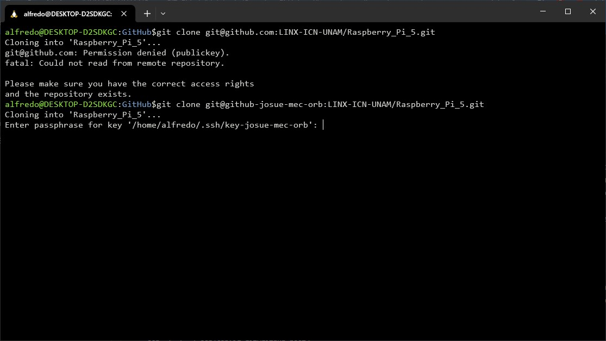

# INDICE

- [INDICE](#indice)
- [Conexión SSH](#conexión-ssh)
  - [Creando un directorio para SSH](#creando-un-directorio-para-ssh)
  - [Creación de la llave RSA](#creación-de-la-llave-rsa)
  - [Configurando el Host](#configurando-el-host)
  - [Conexión de más de un usuario en el mismo equipo (opcional)](#conexión-de-más-de-un-usuario-en-el-mismo-equipo-opcional)
  - [Cambio de permisos](#cambio-de-permisos)
  - [Agregar la llave pública a GitHub](#agregar-la-llave-pública-a-github)
  - [Inciar sesión con SSH](#inciar-sesión-con-ssh)
  - [Conectando más de un usuario por computadora (opcional)](#conectando-más-de-un-usuario-por-computadora-opcional)
- [Enlace entre repositorios git y GitHub](#enlace-entre-repositorios-git-y-github)
  - [Clonar un repositorio remoto](#clonar-un-repositorio-remoto)
  - [Cargar un repositorio remoto](#cargar-un-repositorio-remoto)


# Conexión SSH 

En este punto se recomienda instalar WSL si estás en Windows para ejecutar comandos de Ubuntu en terminal, aunque no es obligatorio. Por tanto, la gran parte de los pasos es la misma en Linux (distribuciones basadas en Debian como Ubuntu o Mint), y Windows con WSL. Si se usa Windows nativo (sin WSL), los siguientes comandos se deberán ejecutar desde Powershell, y comúnmente la diferencia entre un comando en Linux y en Powershell será la terminación <b>.exe</b> de ejecutable (ejemplo, `ssh` en Linux/WSL, y `ssh.exe` en Powershell). En ambos SOs usaremos la terminal, ya sea la de Linux, el WSL, o el Powershell de Windows.


## Creando un directorio para SSH

Para conectar el repositorio local con un repositorio de GitHub, usaremos la conexión SSH, para lo cual necesitamos una clave RSA. Primero, en el directorio home de Linux o de WSL del usuario en tu computadora (`~` o `/home/you_user` en Linux, la misma ruta en WSL Windows) crea una nueva carpeta <b>~/.ssh</b>, y abre la terminal dentro de ella. Puedes hacerlo con los siguientes comandos:

```bash
#Cambiar al home de tu usuario
cd ~
#Crear directorio
mkdir .ssh
#Entrar al directorio
cd .ssh
```

Si vas a usar WSL, es importante usar la ruta `~` del WSL en vez de tu carpeta de usuario personal en Windows (comunmente `C:\Users\your_user`) pues sólo puedes gestionar permisos con comandos de Unix dentro de los directorios de WSL, no en los nativos de Windows. Por el contrario, si usarás Windows nativamente en vez de WSL, debes ir a tu home de usuario (la ruta `C:\Users\your_user` en lugar de `~`), y ahí crear la carpeta <b>.ssh</b>, posteriormente abre la terminal dentro de `.ssh` o entra en ella con un `cd`:

```Powershell
#Entrar a .ssh en Windows
cd C:\Users\your_user\.ssh
```


## Creación de la llave RSA

Ejecuta el siguiente comando para generar una llave RSA:

```bash
ssh-keygen -N "passphrase"
```

O si estás en Windows, el comando es:

```Powershell
ssh-keygen.exe -N "passphrase"
```

El argumento adicional `-N "passphrase"` es opcional y por tanto se puede omitir, sirve para crear la llave usando una frase o palabra secreta (puedes usar la que quieras en vez de "passphrase") como semilla generadora, pero la llave puede crearse sin usar una palabra secreta. Por mayor seguridad, se recomienda usar la passphrase, de este modo, las futuras conexiones la pedirán siempre que se haga una consulta con GitHub, sirviendo como una contraseña.

Al ejecutar el comando, pedirá que se ingrese un nombre para el archivo de la clave, puedes poner el que sea, por ejemplo, `my_key1`, y dicha clave se guardará en la carpeta <b>.ssh</b> donde estás ejecutando el comando. Si vas a la carpeta, verás que se han generado dos archivos, `my_key1` (sin extensión, pero puede abrirse con cualquier editor de texto plano como Bloc de Notas), el archivo de clave privada, y que por tanto no debe compartirse; y `my_key1.pub`, el archivo con la clave pública de cifrado. También puedes comprobar esto listando los archivos del directorio actual (en Linux):

```bash
ls -a
```

Y en Windows basta con abrir la carpeta <b>.ssh</b> en vez de ejecutar `ls` para ver que se han generado 2 archivos de clave.

## Configurando el Host

Dentro de la carpeta <b>.ssh</b> (todavía) debes crear un archivo llamado `config`. Desde la terminal Linux o WSL esto se hace con:

```bash
touch config
```

O en Windows simplemente con click derecho y "Crear Nuevo Documento". Este archivo lo podemos abrir con Bloc de Notas (o equivalentes en Linux), o también con VS Code:

```bash
code config
```

y agregamos lo siguiente (en Linux):

```text
#Primer host
Host github-host1
  HostName github.com
  User git
  IdentityFile ~/.ssh/my_key1
```

Y en Windows, debemos cambiar la ruta del IdentityFile:


```text
#Primer host
Host github-host1
  HostName github.com
  User git
  IdentityFile C:\Users\your_user\.ssh\my_key1
```

En donde puedes cambiar "github-host1" por cualquier nombre que quieras, pero se recomienda uno alusivo al repositorio y usuario (tú) para distinguirlo de cualquier otra conexión a SSH o a GitHub por parte de otros usuarios del equipo. De igual modo, en la línea de `IdentityFile` debes cambiar `my_key1` por el nombre de archivo que le pusiste a tu clave privada, pero <b>siempre escribiendo la ruta completa (no la relativa) de la clave</b>. Además, si el nombre de tu carpeta de usuario tiene espacios o caracteres especiales, la ruta se debe poner entre comillas, por ejemplo, `"C:\Users\tu usuario\.ssh\my_key1"`.

## Conexión de más de un usuario en el mismo equipo (opcional)
Esta parte es opcional.

Si se requiriera conectar más usuarios ya sea a éste o a otros repositorios GitHub, se pueden copiar las líneas anteriores para cada usuario y añadirlas al archivo `config`, siempre y cuando los nombres del `Host` sean distintos para cada uno. Además, respeta la identación de cada Host de la lista. Un ejemplo de `config` para dos usuarios sería el siguiente:

```text
#Primer host (para el primer usuario)
Host github-host1
  HostName github.com
  User git
  IdentityFile ~/.ssh/my_key1

#Segundo host (para el segundo usuario)
Host github-host2
  HostName github.com
  User git
  IdentityFile ~/.ssh/my_key2
```

Y recordando que si estás en Windows, debes cambiar las rutas a las llaves privadas con una ruta de Windows, como `C:\Users\your_user\.ssh\my_key`.

## Cambio de permisos

Para que la conexión SSH funcione, se requiere que el archivo de clave privada sólo tenga permisos de acceso para el propietario del archivo. Normalmente el comando `ssh-keygen` asigna los permisos adecuados de forma automática al crear la llave (tanto en Windows como en Linux), pero en caso de que no ocurra, se pueden estableccer en cualquier momento. Para asegurar estos permisos en Linux y WSL, se debe ejecutar lo siguiente aún dentro del directorio `~/.ssh` (lo cual aseguras con un `cd ~/.ssh`):

```bash
chmod 600 my_key1
```

Y en Windows, basta con dirigirse a <b>.ssh</b>, dar click derecho al archivo de llave privada, y cambiar los permisos, asegurando que sólo el administrador pueda leer y escribir en él.

## Agregar la llave pública a GitHub

Ahora, debes abrir tu repositorio de GitHub, o uno perteneciente a alguna organización (ejemplo, LINX) una vez que el dueño de ese repositorio te haya dado los permisos para editarlo. Dentro del repositorio, ve a `Settings`, y luego en el menú del lado izquierdo ve a `Deploy Keys`. Dale a `Add deploy key`, y en el recuadro `Key` pega la clave que aparece dentro del archivo de llave pública `my_key1.pub` (puedes abrir el archivo con el Bloc de Notas, seleccionar todo `Ctrl+A` y luego copiar `Ctrl+C`). Bajo ninguna circunstancia debes pegar la clave privada que aparece en el archivo sin extensión `my_key1`. Finalmente, agrega algún título alusivo en el recuadro `Title` en GitHub, activa los permisos de escritura (Writing Access) en la casilla debajo del cuadro de la clave, y dale a guardar llave.

## Inciar sesión con SSH

Con las claves (pública y privada) y el archivo `config` en la carpeta correcta `~/.ssh` (o `C:\Users\your_user\.ssh` en Windows), y los permisos adecuados para la llave privada, ya se puede iniciar sesión mediane SSH. En Linux y WSL debes ejecutar:

```bash
ssh -T -F ~/.ssh/config git@github-host1
```

Y en Windows:

```Powershell
ssh.exe -T -F "C:\Users\your_user\.ssh\config" git@github-host1
```

En donde el parámetro `-T` indica que la conexión se efectúa sin el modo de (pseudo)terminal activado, lo cual es necesario en GitHub ya que no vamos a usar comandos de Bash en el servidor remoto (GitHub); el parámetro `-F ruta/a/config` es opcional y sirve para indicar la ruta del archivo `config`, si se omite toma por defecto la ruta `~/.ssh/config` en Linux nativo (pero parece que en Windows y WSL no, por lo que en Windows sí se debe escribir la ruta del `config`), y finalmente se escribe el nombre de usuario `git` (para hacer push en Git siempre se usa este nombre) seguido de un arroba y el host que especificaste en `config`. Posteriormente el programa te pedirá que ingreses la passphrase con la que creaste la llave asignada al host, y con esto se iniciará sesión.

## Conectando más de un usuario por computadora (opcional)

Si más de un usuario se requiere conectar a sus respectivos repositorios de GitHub en el mismo equipo, basta con repetir el comando del punto anterior, pero cambiando el nombre del host (después del arroba) por el host asignado a ese repositorio. Por ello es importante el archivo `config` con distintos Hosts. Por ejemplo, para conectar un segundo usuario:

```bash
ssh -T -F ~/.ssh/config git@github-host2
```

Y el programa solicitará al usuario ingresar su passphrase para `my_key2`. En Windows simplemente se agrega la terminación <b>.exe</b> al comando `ssh`, y se usa la ruta `"C:\Users\your_user\.ssh\config"` del `config` en Windows.


# Enlace entre repositorios git y GitHub 

## Clonar un repositorio remoto

Para bajar un repositorio remoto para **colaborar** se debe bajar utilizando la conexión **SSH**. Para ello en el repositorio remoto se debe hacer lo siguiente:

   1. En la ventana del repositorio, click en `code`
   2. Se depliega la ventana **Local**, entrar a la pestaña `SSH`
   3. Copiar en el portapapeles el link, ejemplo:

      ```bash
      git@github.com:LINX-ICN-UNAM/nombre-del-repositorio.git
      ```


Para poder clonar desde nuestra organización se debe usar la [llave y contraseña](GitHub.md#inciar-sesión-con-ssh)
 para **SSH** por lo que ya debe haber sido aprobada esa llave para utilizarla. Si aun no tienes aprobada tu llave o si desconoces del tema avisa a [Josué Rodríguez](https://github.com/alfjosue1997), [Fernando Caballero](https://github.com/Ferman333), o a [Addi Trejo](https://github.com/Additrejo).

 Con el **link** utilizaras el comando `git clone` en la terminal, ya sea bash, wsl, git o powershell pero deberas cambiar `github.com` por el host que quieras utilizar, de lo contrario aparecerá un error. Eso es debido a que el Hostname ya no es `@github` sino que deberas usar alguno de los alias que usaste en el archivo *.ssh*, ejemplo:

```bash
git@github-host1:LINX-ICN-UNAM/nombre-del-repositorio.git
```



Con el host que ingresen les pedira la contraseña de la llave SSH asociada. Asi podrán clonar el repositorio remoto


Para poder bajar un repositorio remoto pero **sin colaborar** con el se puede hacer lo siguiente en la consola:

```Bash
git clone https://github.com/TU-USUARIO/TU-REPO.git
```

El problema es que no permitira subir archivos debido a que GitHub ya no permite usuario y contraseña en la conexión **HTTPS**.


## Cargar un repositorio remoto

Para cargar un repositorio a GitHub varia un poco si empezaste desde `git init` o desde `git clone`

Si comenzaste desde `git init`. Se abre la carpeta oculta `.git` del repositorio local de tu proyecto (esta carpeta se crea automáticamente al ejecutar `git init` o `git clone`), y luego se abre el archivo `config` de ese Git (NO CONFUNFIR con el `config` de <b>.ssh</b>). Ahora, se debe buscar la sección que contiene los datos del repositorio remoto, y edítala para que se vea como sigue:

```bash
[remote "origin"]
  url = github-host1:your_user/your_repo.git
  fetch = +refs/heads/*:refs/remotes/origin/*
```

En la línea de `url` se debe cambiar el `github-host1` por el nombre que asignaste a tu Host en SSH, y `your_user/your_repo.git` es el nombre del usuario propietario en GitHub seguido del nombre del repositorio donde estás trabajando. 

Tambien se puede hacer desde la terminal:
```bash
git remote add origin github-host1:your_user/your_repo.git
```
opcional: renombrar la rama principal a 'main'
```bash
git branch -M main 
```

Tras esto, cualquier push que se haga mediante Git será enviado a GitHub mediante el host personalizado `github-host1` creado en pasos anteriores, el cual ya tiene asignada la misma llave de acceso que cargaste en el repositorio remoto GitHub con DeployKeys. 

Si comenzaste desde `git clone`. Lo mas probable es que tu archivo `config` ya tenga esto por defecto.

Ahora, ya se puede ejecutar el primer push, sólo ve a la carpeta del proyecto donde inicializaste Git, abre una terminal ahí mismo y ejecuta (es lo mismo en Windows que en Linux):

```bash
git push -u origin main
```

Si creaste la llave RSA con una passphrase, cada vez que hagas push se te pedirá de nuevo. Esto agrega una capa de seguridad para que usuarios no autorizados con acceso al equipo no intenten mandar código hacia este repositorio, o simplemente que no lo manden aquí por error confundiéndolo con su repositorio (en caso de haber más de una persona usando GitHub en el mismo equipo). 

El nombre del remoto "origin" y la rama de trabajo actual (en este ejemplo "main") son recordados por Git, por lo que en los siguientes  <i>push</i> ya no es necesario especificarlos, y podrías ejecutar simplemente:

```bash
git push
```

Aunque la passphrase te la pedirá siempre.